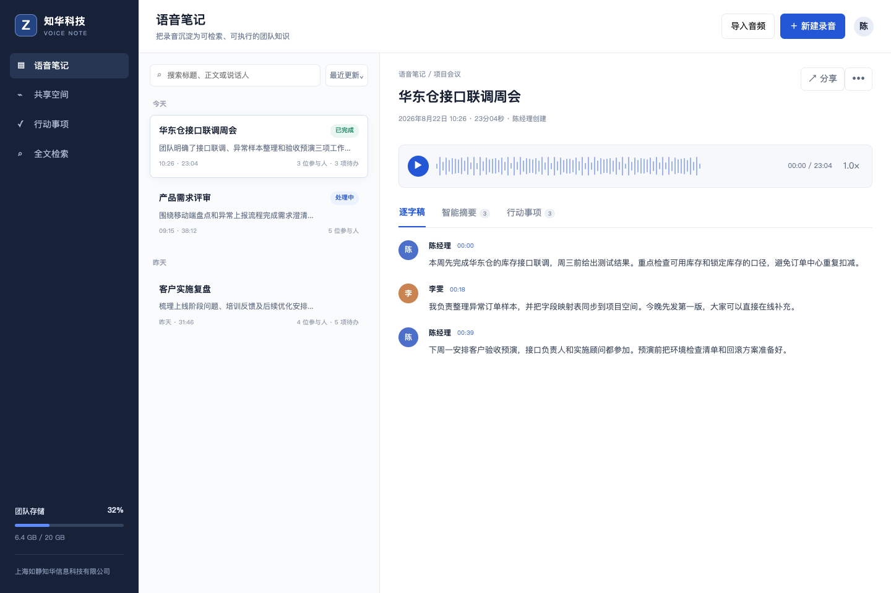
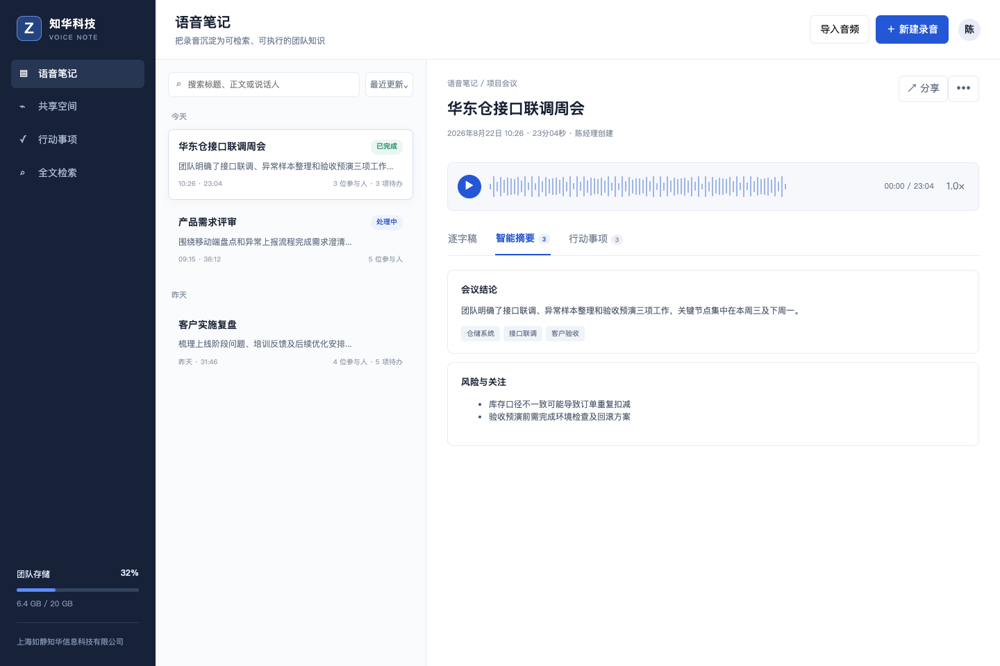

# ZhuaTech VoiceNote｜知华科技智能语音笔记系统

ZhuaTech VoiceNote 是上海如静知华信息科技有限公司推出的智能语音笔记社区源码项目，将录音整理为带时间轴的逐字稿、主题摘要和可跟踪行动事项，适合项目周会、客户访谈、现场巡检和个人灵感记录。

[知华科技官网](https://www.zhuatech.cn/) · Java 包名 `cn.zhuatech.voicenote` · API `POST /api/voicenotes/process`

> 默认使用本地确定性演示数据，不上传真实音频、不内置模型和密钥。项目预留 ASR 服务及 DeepSeek 兼容接口，使用者自行配置并承担数据合规责任。



工作台采用三栏信息架构：左侧承载团队级功能入口，中间按状态与时间管理语音记录，右侧集中呈现播放器、逐字稿、智能摘要和行动事项。界面保持克制的企业工具风格，适合进一步扩展为会议、访谈、巡检等垂直版本。

## 这套工程解决什么问题

普通录音文件难搜索、难协作，也无法直接转化为工作任务。本项目将处理链路拆分为音频资产、转写分段、说话人、摘要主题和行动事项，使前端界面、Java API 与 MySQL 表结构保持一致。

| 能力 | 社区源码版实现 |
| --- | --- |
| 语音采集 | 导入/录音入口及音频对象引用，演示版不保存真实音频 |
| 逐字稿 | 时间轴、说话人分离、段落定位与全文搜索界面 |
| 智能整理 | 标题、摘要、主题标签、风险提示和行动事项 |
| 合规控制 | 参与人知情确认、仅限草稿状态、留存天数及删除边界 |
| 模型扩展 | ASR Provider 与 DeepSeek 兼容环境变量，不绑定厂商 |
| 工程能力 | Java 21、Spring Boot、H5、MySQL 8、Docker Compose、自动化测试 |

### 智能摘要与风险关注

摘要页把长录音压缩为会议结论、主题标签和风险关注项。演示逻辑完全在本地生成；接入外部模型后仍建议保留人工复核、来源定位和权限控制，避免把模型输出直接当作业务事实。



## 运行方式

启动 API：

```bash
cd backend
mvn spring-boot:run
```

前端可以直接打开 `frontend/index.html`，或运行完整容器：

```bash
docker compose up --build
```

浏览器访问 `http://localhost:8088`。后端未运行时，页面自动使用相同结构的本地演示结果。

## 模型接入预留

```dotenv
ZHUATECH_ASR_PROVIDER=local
ZHUATECH_ASR_BASE_URL=
ZHUATECH_ASR_MODEL=asr-provider-model
ZHUATECH_ASR_API_KEY=
ZHUATECH_LLM_PROVIDER=local
ZHUATECH_LLM_BASE_URL=https://api.deepseek.com
ZHUATECH_LLM_MODEL=deepseek-chat
ZHUATECH_LLM_API_KEY=
```

生产接入时建议把音频上传、ASR、说话人分离、摘要与任务提取设计为异步流水线，并配置对象存储加密、访问审计、数据删除和失败重试。

## 隐私与使用边界

- 录音前应取得参与人的明确知情同意，并说明用途与留存期限。
- 不得用于窃听、秘密录音、员工非法监控或处理无权访问的内容。
- 页面输出属于辅助整理结果，重要结论、责任人和日期应由人工确认。
- 本工程不包含任何第三方模型、音频样本、API Key 或生产账号。

## 许可与商业服务

本工程仅限个人学习、研究和非商业技术交流，**不得商用**。企业内部使用、SaaS 部署、软件实施、模型接入、品牌定制与项目交付均须获得上海如静知华信息科技有限公司书面授权，详见 [LICENSE](LICENSE)。

| 微信咨询一 | 微信咨询二 |
| --- | --- |
|  |  |

深度开发与软件项目外包请访问：[https://www.zhuatech.cn/](https://www.zhuatech.cn/)

SEO：智能语音笔记源码、录音转文字系统、AI 会议笔记、说话人分离、自动摘要、行动事项提取、DeepSeek Java、企业知识沉淀、知华科技。
